# Romberg Integration Method

## Praktikum 2 KomNum 2022

### Anggota Kelompok

* Nama : Nadif Mustafa
* NRP : 5025211127

---

* Nama : Frederick Yonatan Susanto
* NRP : 5025211121

---

* Nama : Nizam Hakim Santoso
* NRP : 5025211209

### Dokumen Laporan

Berikut adalah penjelasan bagian-bagian dari program kami

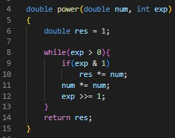

Function di atas berfungsi untuk menghitung perpangkatan menggunakan konsep yang mirip dengan [*Modular Exponentiation*](https://www.geeksforgeeks.org/modular-exponentiation-power-in-modular-arithmetic/), sehingga kompleksitas waktunya adalah $ O(logN) $.

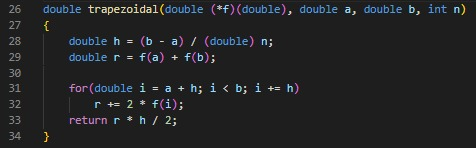

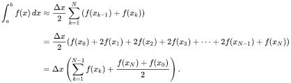

Function di atas berfungsi untuk menghitung hasil integrasi menggunakan Metode Trapezoidal, rumus yang digunakan pada function tersebut sudah ditampilkan pada gambar di atas.

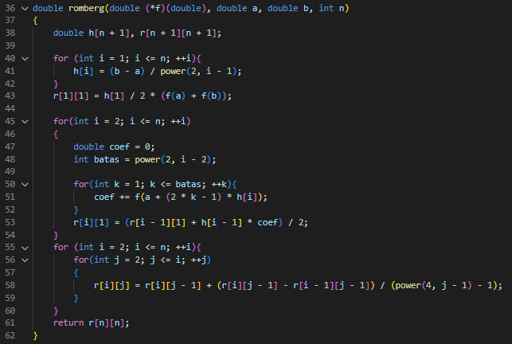

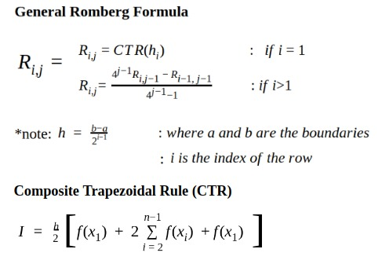

Function di atas berfungsi untuk menghitung hasil integrasi menggunakan Metode Romberg, rumus yang digunakan pada function tersebut sudah ditampilkan pada gambar di atas.

Berikut adalah keterangan nama-nama variabel yang digunakan pada function **trapezoidal** dan **romberg** :

* **f :** fungsi f(x) yang ingin dihitung hasil integralnya
* **a :** batas bawah integral
* **b :** batas atas integral
* **n :** banyak pembagian / banyak pias
* **h :** selisih antar nilai x ($ \Delta x $)
* **r :** hasil perhitungan integral

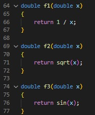

Ketiga fungsi di atas adalah contoh fungsi yang akan dihitung nilai integralnya, program ini tidak menerima *user input*, sehingga seluruh data berupa *hard code*.

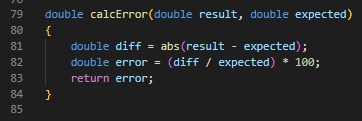

Function di atas berfungsi untuk menghitung *Error* yang didapatkan dari perhitungan integral menggunakan metode **trapezoidal** dan **romberg**, dengan cara membandingkan nilainya dengan hasil perhitungan integral secara analitik.

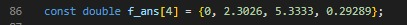

Array di atas berfungsi untuk menyimpan hasil-hasil perhitungan integral secara analitik, index ke-*i* menyimpan hasil perhitungan integral dari $ f_i $.

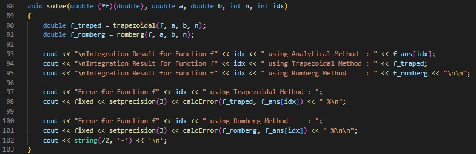

Void di atas berfungsi untuk menghitung dan menampilkan hasil perhitungan integral menggunakan metode **trapezoidal** dan **romberg** beserta besarnya *Error*.

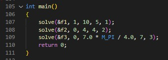

Pada main, cukup dimasukkan fungsi-fungsi yang akan dihitung nilai integralnya beserta batas-batas integral dan banyaknya pias.

Berikut adalah output yang ditampilkan dari program

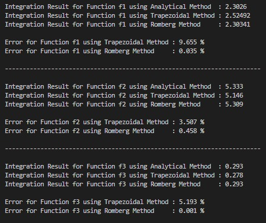
